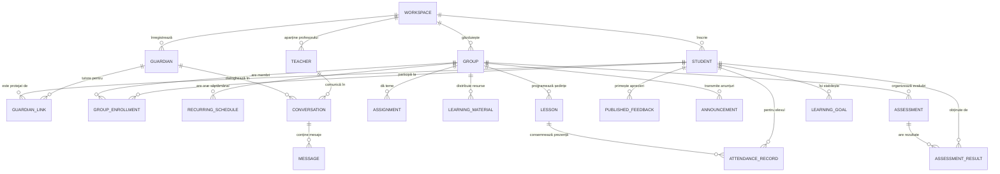

# INITIAL DATA MODEL & PRISMA SCHEMA — MEAI Edu

> **Versiune document:** 2.0.0 (Revizuit — Model Profesor Individual)  
> **Status:** Specificație Schemă Bază de Date & Entități Prisma  
> **Target:** PostgreSQL + Prisma Schema + TypeScript Domain Types

---

## 1. Diagrama Entitate-Relație (ERD)



---

## 2. Preview Fișier Prisma (`prisma/schema.prisma`)

```prisma
datasource db {
  provider = "postgresql"
  url      = env("DATABASE_URL")
}

generator client {
  provider = "prisma-client-js"
}

enum Role {
  TEACHER
  PARENT
  STUDENT
}

enum GroupType {
  SCHOOL_CLASS          // Clasă de școală (ex. Clasa a VII-a B)
  TUTORING_GROUP        // Grupă de meditații (ex. Pregătire Evaluare Națională)
  WORKSHOP              // Atelier / Cerc aplicat (ex. Robotică)
  INDIVIDUAL_LESSON     // Meditație 1-la-1
}

enum AttendanceStatus {
  PRESENT
  ABSENT
  LATE
  EXCUSED
}

enum AssessmentType {
  TEST                  // Test scris
  ORAL                  // Evaluare orală
  PROJECT               // Proiect practic
  WORKSHEET             // Fișă de lucru
  HOMEWORK_CHECK        // Verificare temă
}

enum GuardianRelationship {
  MOTHER
  FATHER
  LEGAL_GUARDIAN
}

model Workspace {
  id          String    @id @default(cuid())
  name        String    // ex. "Spațiul Didactic Prof. Radu Teodorescu"
  ownerId     String    @unique
  owner       Teacher   @relation(fields: [ownerId], references: [id])
  groups      Group[]
  students    Student[]
  guardians   Guardian[]
  createdAt   DateTime  @default(now())
  updatedAt   DateTime  @updatedAt
}

model Teacher {
  id            String         @id @default(cuid())
  email         String         @unique
  firstName     String
  lastName      String
  title         String?        // "Profesor Matematică & Informatică"
  phone         String?
  bio           String?
  workspace     Workspace?
  conversations Conversation[]
  createdAt     DateTime       @default(now())
  updatedAt     DateTime       @updatedAt
}

model Student {
  id              String             @id @default(cuid())
  workspaceId     String
  workspace       Workspace          @relation(fields: [workspaceId], references: [id])
  firstName       String
  lastName        String
  fatherInitial   String?            // "M."
  email           String?            @unique
  phone           String?
  dateOfBirth     DateTime?
  avatarUrl       String?
  privateNotes    String?            // Strict confidențial profesor (Private Teacher Notes)
  
  guardianLinks   GuardianLink[]
  enrollments     GroupEnrollment[]
  attendance      AttendanceRecord[]
  results         AssessmentResult[]
  feedbacks       PublishedFeedback[]
  goals           LearningGoal[]
  createdAt       DateTime           @default(now())
  updatedAt       DateTime           @updatedAt
}

model Guardian {
  id            String             @id @default(cuid())
  workspaceId   String
  workspace     Workspace          @relation(fields: [workspaceId], references: [id])
  firstName     String
  lastName      String
  email         String             @unique
  phone         String
  relationship  GuardianRelationship @default(LEGAL_GUARDIAN)
  
  studentLinks  GuardianLink[]
  conversations Conversation[]
  createdAt     DateTime           @default(now())
  updatedAt     DateTime           @updatedAt
}

model GuardianLink {
  id          String    @id @default(cuid())
  guardianId  String
  guardian    Guardian  @relation(fields: [guardianId], references: [id], onDelete: Cascade)
  studentId   String
  student     Student   @relation(fields: [studentId], references: [id], onDelete: Cascade)
  status      String    @default("ACTIVE") // ACTIVE, PENDING
  createdAt   DateTime  @default(now())

  @@unique([guardianId, studentId])
}

model Group {
  id          String              @id @default(cuid())
  workspaceId String
  workspace   Workspace           @relation(fields: [workspaceId], references: [id])
  name        String              // "Pregătire Evaluare Națională (Matematică)"
  type        GroupType           @default(TUTORING_GROUP)
  description String?
  colorTag    String?             // "#4A77DA" (pentru calendar)
  
  enrollments GroupEnrollment[]
  schedules   RecurringSchedule[]
  lessons     Lesson[]
  assignments Assignment[]
  materials   LearningMaterial[]
  assessments Assessment[]
  announcements Announcement[]
  createdAt   DateTime            @default(now())
  updatedAt   DateTime            @updatedAt
}

model GroupEnrollment {
  id        String    @id @default(cuid())
  groupId   String
  group     Group     @relation(fields: [groupId], references: [id], onDelete: Cascade)
  studentId String
  student   Student   @relation(fields: [studentId], references: [id], onDelete: Cascade)
  enrolledAt DateTime @default(now())
  status    String    @default("ACTIVE")

  @@unique([groupId, studentId])
}

model RecurringSchedule {
  id          String    @id @default(cuid())
  groupId     String
  group       Group     @relation(fields: [groupId], references: [id], onDelete: Cascade)
  dayOfWeek   Int       // 1 = Luni, 2 = Marți ... 7 = Duminică
  startTime   String    // "16:00"
  endTime     String    // "18:00"
  roomOrLink  String?   // "Cabinet Matematică" sau link Google Meet
}

model Lesson {
  id          String             @id @default(cuid())
  groupId     String
  group       Group              @relation(fields: [groupId], references: [id], onDelete: Cascade)
  title       String             // "Lecția 5: Teorema celor trei perpendiculare"
  date        DateTime
  startTime   String
  endTime     String
  lessonNotes String?            // Notițe de conținut abordat
  
  attendance  AttendanceRecord[]
  materials   LearningMaterial[]
  createdAt   DateTime           @default(now())
}

model AttendanceRecord {
  id          String           @id @default(cuid())
  lessonId    String
  lesson      Lesson           @relation(fields: [lessonId], references: [id], onDelete: Cascade)
  studentId   String
  student     Student          @relation(fields: [studentId], references: [id], onDelete: Cascade)
  status      AttendanceStatus @default(PRESENT)
  note        String?          // "A întârziat 10 min din cauza transportului"
  createdAt   DateTime         @default(now())

  @@unique([lessonId, studentId])
}

model Assignment {
  id          String    @id @default(cuid())
  groupId     String
  group       Group     @relation(fields: [groupId], references: [id], onDelete: Cascade)
  title       String    // "Fișa de exerciții #4 - Geometrie în spațiu"
  description String
  assignedDate DateTime @default(now())
  dueDate     DateTime
  createdAt   DateTime  @default(now())
}

model LearningMaterial {
  id          String    @id @default(cuid())
  groupId     String
  group       Group     @relation(fields: [groupId], references: [id], onDelete: Cascade)
  lessonId    String?
  lesson      Lesson?   @relation(fields: [lessonId], references: [id])
  title       String    // "Sinteză Teorie: Relații Metrice"
  url         String?   // Link fișier / Google Drive / PDF
  fileType    String?   // "PDF", "VIDEO", "LINK"
  createdAt   DateTime  @default(now())
}

model Assessment {
  id          String             @id @default(cuid())
  groupId     String
  group       Group              @relation(fields: [groupId], references: [id], onDelete: Cascade)
  title       String             // "Test Sumativ: Algebră - Calcul Algebric"
  type        AssessmentType     @default(TEST)
  maxScore    Float              @default(10.0)
  date        DateTime
  
  results     AssessmentResult[]
  createdAt   DateTime           @default(now())
}

model AssessmentResult {
  id                  String     @id @default(cuid())
  assessmentId        String
  assessment          Assessment @relation(fields: [assessmentId], references: [id], onDelete: Cascade)
  studentId           String
  student             Student    @relation(fields: [studentId], references: [id], onDelete: Cascade)
  score               Float      // ex. 9.50
  privateTeacherNotes String?    // Strict confidențial profesor (Private Notes)
  publishedFeedback   String?    // Feedback cald publicat către familie
  isPublished         Boolean    @default(true)
  createdAt           DateTime   @default(now())
  updatedAt           DateTime   @updatedAt

  @@unique([assessmentId, studentId])
}

model PublishedFeedback {
  id          String    @id @default(cuid())
  studentId   String
  student     Student   @relation(fields: [studentId], references: [id], onDelete: Cascade)
  content     String    // "Progres remarcabil la demonstrațiile de geometrie!"
  category    String    // "PROGRESS", "ENCOURAGEMENT", "ATTENTION"
  createdAt   DateTime  @default(now())
}

model Announcement {
  id          String    @id @default(cuid())
  groupId     String?   // null = anunț general pentru toți elevii
  group       Group?    @relation(fields: [groupId], references: [id], onDelete: Cascade)
  title       String
  content     String
  createdAt   DateTime  @default(now())
}

model Conversation {
  id          String    @id @default(cuid())
  teacherId   String
  teacher     Teacher   @relation(fields: [teacherId], references: [id])
  guardianId  String
  guardian    Guardian  @relation(fields: [guardianId], references: [id])
  studentId   String?   // Despre care elev se discută
  
  messages    Message[]
  updatedAt   DateTime  @updatedAt
  createdAt   DateTime  @default(now())

  @@unique([teacherId, guardianId])
}

model Message {
  id              String       @id @default(cuid())
  conversationId  String
  conversation    Conversation @relation(fields: [conversationId], references: [id], onDelete: Cascade)
  senderRole      Role
  senderId        String
  content         String
  isRead          Boolean      @default(false)
  sentAt          DateTime     @default(now())
}

model LearningGoal {
  id          String    @id @default(cuid())
  studentId   String
  student     Student   @relation(fields: [studentId], references: [id], onDelete: Cascade)
  title       String    // "Să rezolv 15 probleme de trigonometrie fără ezitare"
  targetDate  DateTime?
  isCompleted Boolean   @default(false)
  completedAt DateTime?
  createdAt   DateTime  @default(now())
}
```
