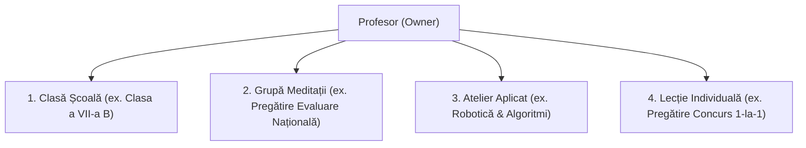

# MVP SCOPE — MEAI Edu (Gestiune Didactică & Conectare Familie)

> **Versiune document:** 2.0.0 (Revizuit — Model Profesor Individual)  
> **Status:** Specificație Produs & Scope MVP  
> **Destinație:** Cadre didactice, profesori particulari, meditatori și îndrumători de ateliere

---

## 1. Declarația de Viziune & Problema Rezolvată

### Contextul Didactic Real
Cadrele didactice active din România (profesori de liceu/gimnaziu, meditatori particulari, traineri de ateliere și cluburi educaționale) își desfășoară adesea activitatea pe multiple planuri paralele:
1. **Predare la clase de școală** (unde doresc o evidență clară a progresului elevilor).
2. **Grupe de meditații particulare** (pregătire intensivă pentru Evaluarea Națională, Bacalaureat sau admitere facultate).
3. **Ateliere practice și cercuri** (ex. robotică, programare, club de lectură, astronomie).
4. **Lecții individuale 1-la-1** (recuperare sau performanță olimpică).

### Problema Curentă
Profesorii sunt nevoiți să jongleze cu agende pe hârtie, foi de calcul Excel dezorganizate, grupuri haotice de WhatsApp și canale disparate de email pentru a ține evidența prezenței, temelor, notelor și pentru a răspunde întrebărilor repetate ale părinților.

### Misiunea MEAI Edu
**MEAI Edu** oferă profesorului un **spațiu unic, elegant, calm și complet integrat** pentru gestionarea activității educaționale și o punte directă și călduroasă de comunicare cu părinții și elevii.

---

## 2. Personas (Utilizatori Țintă)

### 🧑‍🏫 1. Profesorul / Titularul Workspace-ului (Teacher / Owner)
- **Profil:** Prof. Radu Teodorescu (Profesor de Matematică & Informatică).
- **Nevoie:** Un spațiu curat unde poate defini grupele de elevi, orarul ședințelor, poate marca prezența, distribui materiale și teme, nota rezultatele, ține notițe private despre evoluția fiecărui copil și comunica ușor cu părinții.
- **Beneficiu:** Economie de timp, organizare impecabilă, evidență clară fără birocrație inutilă.

### 👨‍👩‍👧 2. Părintele / Tutorele Legal (Parent / Guardian)
- **Profil:** Familia Popescu (părinții lui Matei — clasa a VII-a și Sofia — clasa a IX-a).
- **Nevoie:** Să știe exact când are copilul ore/meditații, dacă a ajuns la ședință, ce teme are de pregătit, ce aprecieri a formulat profesorul și să poată adresa o întrebare discretă fără a deranja profesorul pe telefonul personal.
- **Beneficiu:** Liniște, transparență, parteneriat cald cu educatorul copilului.

### 🧑‍🎓 3. Elevul (Student)
- **Profil:** Matei Popescu (elev la clasa a VII-a B și la grupa de pregătire pentru Evaluarea Națională).
- **Nevoie:** Să vadă orarul ședințelor viitoare, enunțurile temelor, materialele puse la dispoziție de profesor, aprecierile primite și obiectivele sale de progres.
- **Beneficiu:** Claritate, autonomie în învățare și încurajare pozitivă.

---

## 3. Tipuri de Grupe Suportate

Fiecare grupă are:
- Nume și descriere
- Tip grupă (`SCHOOL_CLASS`, `TUTORING_GROUP`, `WORKSHOP`, `INDIVIDUAL_LESSON`)
- Elevi înscriși
- Orar de ședințe recurente (zi a săptămânii, interval orar, sală/link online)
- Teme, materiale și anunțuri proprii

---

## 4. Funcționalități Cheie ale MVP-ului (In-Scope)

### A. Gestiune Elevi, Tutori & Înscrieri
- Adăugare elevi cu profil minim (nume, inițială, telefon, detalii relevante).
- Asociere tutori legali cu verificare (`GuardianLink`), suportând familii cu mai mulți copii.
- Înscrierea unui elev în una sau mai multe grupe simultan.

### B. Calendar, Ședințe & Prezență
- Definire orar recurent pe grupe.
- Consemnare rapidă a prezenței la fiecare ședință: `PREZENT`, `ABSENT`, `ÎNTÂRZIAT`, `ÎNVOIT`.

### C. Teme & Materiale Didactice
- Creare teme pentru acasă cu termene limită și instrucțiuni clare.
- Atașare link-uri utile și documente/materiale de studiu.

### D. Rezultate, Notițe Private & Feedback Publicat
- **Rezultate Evaluare:** Înregistrare punctaje, note (1-10) sau calificative pentru teste, fișe de lucru și proiecte.
- **Notițe Private Profesor (Private Notes):** Spațiu strict confidențial unde profesorul notează aspecte pedagogice interne (ex. *„Matei a fost obosit azi, de reluat fracțiile zecimale”*). **Niciun părinte sau elev nu poate citi aceste notițe.**
- **Feedback Publicat către Familie (Published Feedback):** Aprecieri constructive transmise explicit părinților și elevilor (ex. *„Felicitări pentru implicarea excelentă la geometrie!”*).

### E. Comunicare: Anunțuri & Mesagerie
- **Anunțuri pe grupă:** Mesaje generale transmise tuturor membrilor unei grupe.
- **Conversații directe:** Dialog asincron profesor ↔ părinte pentru detalii punctuale.

### F. Obiective Personale (Goals) & Rapoarte Săptămânale
- Stabilire obiective de învățare pentru elevi.
- Sumar săptămânal cald generat automat pentru părinți (prezență, teme, feedback primit).

---

## 5. Ce NU este inclus în MVP (Post-MVP Roadmap)

| Exclus din MVP | Motivare & Planificare |
| :--- | :--- |
| **Catalog Oficial Instituțional** | MEAI Edu este un asistent privat de predare, nu un sistem birocratic de stat. |
| **Directori, Secretariat, Inspectori** | Exclus permanent din acest model centrat pe profesor. |
| **Rol Profesor Asistent** | Post-MVP (poate fi adăugat ulterior dacă profesorul are colaboratori). |
| **Procesare Plăți Online & Facturare** | Faza 2 (urmărirea onorariilor de meditații și plăți cu cardul). |
| **Algoritmi AI de evaluare automată** | Exclus prin politica de etică pedagogică (evaluarea aparține profesorului). |
| **Clasamente Publice între Elevi** | Exclus prin design etic. |
