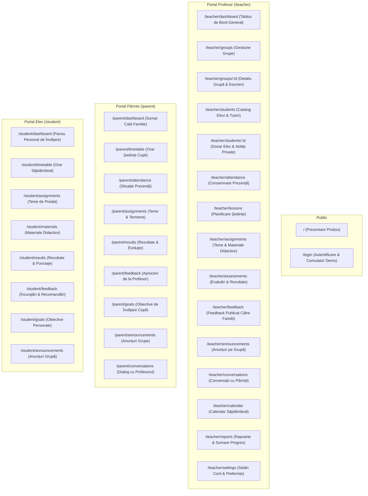

# SCREEN MAP & UI ARCHITECTURE — MEAI Edu

> **Versiune document:** 2.0.0 (Revizuit — Model Profesor Individual)  
> **Status:** Specificație Interfețe Utilizator & Harta Ecranelor  
> **Design Language:** Romanian Educational Minimal, Warm, Calm & Accessible

---

## 1. Harta Generală a Rutelor și Modulelor

---

## 2. Ecrane Publice (Public)

### 2.1. Landing Page (`/`)
- **Utilizator vizat:** Oricine (vizitator, profesor, părinte).
- **Scop principal:** Prezentarea aplicației MEAI Edu ca asistentul digital ideal pentru un profesor dedicat și familiile elevilor săi.
- **Informații cheie:** Organizare grupe, prezență, teme, materiale, feedback cald și mesagerie directă.
- **Acțiune principală:** Buton `Intră în Spațiul Demo` -> redirecționare către `/login`.
- **Stări UI:** Loading (skeleton minimalist), Empty (N/A), Error (alertă discretă).
- **Comportament Mobil:** Layout pe o singură coloană, butoane tactile largi.
- **Permisiuni:** Acces liber.

### 2.2. Login Page & Demo Switcher (`/login`)
- **Utilizator vizat:** Toți utilizatorii demonstrativi.
- **Scop principal:** Selectarea rapidă a identității demo cu un singur click.
- **Informații cheie:** 3 carduri clare:
  1. **Profesor / Owner** — Prof. Radu Teodorescu
  2. **Părinte (2 copii)** — Fam. Radu & Maria Popescu (Matei & Sofia)
  3. **Elev** — Matei Popescu (Clasa a VII-a B & Grupă Meditații)
- **Acțiune principală:** Click pe profilul dorit pentru intrare instantă în sesiune.
- **Comportament Mobil:** Carduri verticale cu spațiere generoasă touch.
- **Permisiuni:** Public.

---

## 3. Modulul Profesor (Teacher Portal)

### 3.1. Overview Dashboard (`/teacher/dashboard`)
- **Utilizator vizat:** `TEACHER` (Owner).
- **Scop principal:** Tablou de bord zilnic — ședințele de azi, teme de verificat, mesaje noi de la părinți, acțiuni rapide.
- **Informații cheie:** Următoarea ședință (grupă, oră, sală/link), număr total elevi activi (20), prezența săptămânii curente, 2 mesaje necitite.
- **Acțiune principală:** Buton `Deschide Ședința Curentă` sau `+ Adaugă Temă / Rezultat`.
- **Stare vidă:** *„Nu aveți ședințe programate astăzi. Bucurați-vă de timpul liber!”*
- **Comportament Mobil:** Cardul ședinței curente pe primul ecran, acțiuni rapide tip floating dock.
- **Permisiuni:** `role == "TEACHER"`.

### 3.2. Groups (`/teacher/groups`)
- **Utilizator vizat:** `TEACHER`.
- **Scop principal:** Vizualizarea și gestionarea tuturor grupelor de învățare.
- **Informații cheie:** Grilă cu cele 4 grupe (Școală VII-B, Meditații Evaluare Națională, Atelier Robotică, Meditație 1-la-1), număr elevi înscriși, program săptămânal.
- **Acțiune principală:** `+ Creează o Grupă Nouă`.
- **Stare vidă:** *„Nu ați creat nicio grupă încă. Începeți prin a adăuga prima grupă.”*
- **Comportament Mobil:** Carduri verticale compacte cu insigne colorate pe tipul grupei.
- **Permisiuni:** `TEACHER`.

### 3.3. Group Details (`/teacher/groups/:id`)
- **Utilizator vizat:** `TEACHER`.
- **Scop principal:** Detaliu grupă: lista elevilor înscriși, orar recurent, teme active, materiale încărcate.
- **Informații cheie:** Nume grupă, tip, program recurent (ex. *Marți 16:00 - 18:00*), tab-uri (*Elevi*, *Teme*, *Materiale*, *Anunțuri*).
- **Acțiune principală:** `+ Înscrie Elev` sau `Editează Grupa`.
- **Stare vidă:** *„Nu există elevi înscriși în această grupă.”*
- **Comportament Mobil:** Tab-uri orizontale cu derulare laterală.
- **Permisiuni:** `TEACHER`.

### 3.4. Students (`/teacher/students`)
- **Utilizator vizat:** `TEACHER`.
- **Scop principal:** Directorul complet al elevilor și al tutorilor asociați.
- **Informații cheie:** Tabel/Listă cu toți cei ~20 de elevi: nume, grupe în care este înscris, date de contact părinți, status înscriere.
- **Acțiune principală:** `+ Adaugă Elev Nou` (cu asociere opțională părinte).
- **Stare vidă:** *„Nu aveți niciun elev înregistrat.”*
- **Comportament Mobil:** Listă căutabilă cu avatar și insigne de grupe.
- **Permisiuni:** `TEACHER`.

### 3.5. Student Details & Private Notes (`/teacher/students/:id`)
- **Utilizator vizat:** `TEACHER`.
- **Scop principal:** Dosarul individual al elevului, istoric rezultate, prezență și **Notițe Private Profesor**.
- **Informații cheie:** Profil elev, tutori asociați (telefon/email), grafic simplu de evoluție, istoric prezență, **Secțiunea „Notițe Private Profesor” (marcată cu lacăt galben - strict secret)**.
- **Acțiune principală:** `+ Adaugă Notiță Privată` sau `Scrie Feedback pentru Familie`.
- **Stare vidă:** *„Nu există notițe sau rezultate pentru acest elev.”*
- **Comportament Mobil:** Formular optimizat pentru tastare rapidă de pe mobil.
- **Permisiuni:** `TEACHER` (acces exclusiv la notițele private).

### 3.6. Attendance (`/teacher/attendance`)
- **Utilizator vizat:** `TEACHER`.
- **Scop principal:** Consemnarea rapidă a prezenței pe ședințe de curs.
- **Informații cheie:** Selector grupă și dată ședință, listă elevi cu butoane segmented: `Prezent`, `Absent`, `Întârziat`, `Învoit`.
- **Acțiune principală:** `Salvează Prezența`.
- **Stare vidă:** *„Selectați o grupă și o dată pentru a marca prezența.”*
- **Comportament Mobil:** Butoane tactile mari pentru bifare într-o secundă.
- **Permisiuni:** `TEACHER`.

### 3.7. Lessons & Schedule (`/teacher/lessons`)
- **Utilizator vizat:** `TEACHER`.
- **Scop principal:** Planificarea calendaristică a ședințelor și a tematicilor abordate.
- **Informații cheie:** Lista ședințelor cronologice, titlu tematică (ex. *„Lecția 4: Teorema lui Thales și Aplicații”*), materiale asociate.
- **Acțiune principală:** `+ Programează Ședință Nouă`.
- **Comportament Mobil:** Vizualizare tip agendă cronologică.
- **Permisiuni:** `TEACHER`.

### 3.8. Assignments (`/teacher/assignments`)
- **Utilizator vizat:** `TEACHER`.
- **Scop principal:** Crearea și urmărirea temelor pentru acasă alocate grupelor.
- **Informații cheie:** Titlu temă, grupă alocată, dată limită, număr elevi care au predat, atașamente/fișe.
- **Acțiune principală:** `+ Creează Temă Nouă`.
- **Stare vidă:** *„Nu există teme active în acest moment.”*
- **Comportament Mobil:** Carduri de teme cu indicatori de termen limită.
- **Permisiuni:** `TEACHER`.

### 3.9. Assessments & Results (`/teacher/assessments`)
- **Utilizator vizat:** `TEACHER`.
- **Scop principal:** Înregistrarea rezultatelor la teste, fișe de lucru și evaluări formative.
- **Informații cheie:** Matrice de rezultate pe grupă: Nume elev, evaluare, punctaj/notă (1-10 sau procentaj), feedback atașat, status (`DRAFT` sau `PUBLISHED`).
- **Acțiune principală:** `+ Adaugă Rezultate Evaluare` și `Publică către Părinți`.
- **Stare vidă:** *„Nu există evaluări înregistrate pentru această grupă.”*
- **Comportament Mobil:** Tabel fluid cu coloană fixată pentru numele elevului.
- **Permisiuni:** `TEACHER`.

### 3.10. Feedback (`/teacher/feedback`)
- **Utilizator vizat:** `TEACHER`.
- **Scop principal:** Gestionarea aprecierilor și a mesajelor de încurajare publicate către familii.
- **Informații cheie:** Lista aprecierilor trimise recent, grupate pe elevi, cu data transmiterii și reacția părintelui.
- **Acțiune principală:** `+ Trimite Feedback Nou către Familie`.
- **Permisiuni:** `TEACHER`.

### 3.11. Announcements (`/teacher/announcements`)
- **Utilizator vizat:** `TEACHER`.
- **Scop principal:** Transmiterea de comunicări și noutăți către toți membrii unei grupe sau către toți elevii.
- **Informații cheie:** Titlu anunț, grupă țintă, dată, text anunț, fișier atașat opțional.
- **Acțiune principală:** `+ Publică Anunț Nou`.
- **Permisiuni:** `TEACHER`.

### 3.12. Conversations (`/teacher/conversations`)
- **Utilizator vizat:** `TEACHER`.
- **Scop principal:** Canal de mesagerie directă și discretă cu părinții elevilor.
- **Informații cheie:** Listă de conversații pe familie/părinte, fir de mesaje cronologic, indicator mesaje necitite.
- **Acțiune principală:** Răspuns la mesaj sau inițiere conversație nouă.
- **Stare vidă:** *„Nu aveți conversații active.”*
- **Comportament Mobil:** Interfață tip chat modernă (bubble-uri de mesaje, tastare facilă).
- **Permisiuni:** `TEACHER`.

### 3.13. Calendar (`/teacher/calendar`)
- **Utilizator vizat:** `TEACHER`.
- **Scop principal:** Vizualizare globală a săptămânii (ședințe, teme cu termen limită, evenimente).
- **Informații cheie:** Grilă săptămânală interactivă (Luni - Duminică), colorată pe codul fiecărei grupe.
- **Comportament Mobil:** Comutare facilă pe vizualizare listă zilnică (*agenda view*).
- **Permisiuni:** `TEACHER`.

### 3.14. Reports & Progress (`/teacher/reports`)
- **Utilizator vizat:** `TEACHER`.
- **Scop principal:** Sinteze de progres educațional și generare de rezumate săptămânale pentru părinți.
- **Informații cheie:** Rata de prezență pe grupe, distribuția temelor finalizate, sumar de progres pe elev.
- **Acțiune principală:** `Generează Sumar Săptămânal pentru Părinți`.
- **Permisiuni:** `TEACHER`.

### 3.15. Settings (`/teacher/settings`)
- **Utilizator vizat:** `TEACHER`.
- **Scop principal:** Configurarea profilului profesorului, a preferințelor de notificare și a setărilor workspace-ului.
- **Informații cheie:** Nume profesor, materii predate, semnătură mesaje, orar de disponibilitate.
- **Permisiuni:** `TEACHER`.

---

## 4. Modulul Părinte (Parent Portal)

### 4.1. Family Dashboard (`/parent/dashboard`)
- **Utilizator vizat:** `PARENT` (Tutore).
- **Scop principal:** Sumarul săptămânal cald și liniștitor al activității copiilor săi.
- **Informații cheie:**
  - Selector copii în antet (Matei Popescu / Sofia Popescu)
  - Card de Bun-Venit cu rezumatul săptămânii (*„Matei are o săptămână excelentă la Matematică: 100% prezență și o apreciere frumoasă!”*)
  - Următoarea ședință a copilului
  - Ultimele rezultate publicate cu explicații
  - Teme viitoare
- **Acțiune principală:** Click pe o temă sau deschidere conversație cu profesorul.
- **Comportament Mobil:** Flux vertical ergonomic și aerisit.
- **Permisiuni:** ReBAC: doar copiii asociați prin `GuardianLink`.

### 4.2. Timetable (`/parent/timetable`)
- **Utilizator vizat:** `PARENT`.
- **Scop principal:** Consultarea orarului complet al ședințelor și meditațiilor copilului.
- **Informații cheie:** Zile, ore, grupă, locație/link online.
- **Permisiuni:** ReBAC pe copilul selectat.

### 4.3. Attendance (`/parent/attendance`)
- **Utilizator vizat:** `PARENT`.
- **Scop principal:** Verificarea prezenței la fiecare ședință.
- **Informații cheie:** Istoric ședințe, status prezență (Prezent, Învoit, Absent), buton de transmitere mesaj de învoire.
- **Permisiuni:** ReBAC pe copilul selectat.

### 4.4. Assignments (`/parent/assignments`)
- **Utilizator vizat:** `PARENT`.
- **Scop principal:** Vizibilitate asupra temelor copilului pentru suport blând acasă.
- **Informații cheie:** Teme curente, cerințe, termen limită, stare rezolvare.
- **Permisiuni:** ReBAC pe copilul selectat.

### 4.5. Results & Evolution (`/parent/results`)
- **Utilizator vizat:** `PARENT`.
- **Scop principal:** Consultarea rezultatelor la evaluări și a evoluției individuale.
- **Informații cheie:** Rezultate publicate de profesor, punctaje, feedback-ul explicativ asociat fiecărei evaluări (fără clasamente).
- **Permisiuni:** ReBAC pe copilul selectat.

### 4.6. Published Feedback (`/parent/feedback`)
- **Utilizator vizat:** `PARENT`.
- **Scop principal:** Mesajele de încurajare și recomandările pedagogice transmise de profesor.
- **Informații cheie:** Carduri de feedback cald, data, profesorul îndrumător.
- **Permisiuni:** ReBAC pe copilul selectat.

### 4.7. Goals (`/parent/goals`)
- **Utilizator vizat:** `PARENT`.
- **Scop principal:** Urmărirea obiectivelor educaționale stabilite împreună cu profesorul și copilul.
- **Informații cheie:** Ținte de învățare și stadiul atingerii lor.
- **Permisiuni:** ReBAC pe copilul selectat.

### 4.8. Announcements (`/parent/announcements`)
- **Utilizator vizat:** `PARENT`.
- **Scop principal:** Noutăți și anunțuri de la profesor pentru grupele în care sunt înscriși copiii.
- **Permisiuni:** ReBAC pe grupele copilului.

### 4.9. Conversations (`/parent/conversations`)
- **Utilizator vizat:** `PARENT`.
- **Scop principal:** Dialog direct și discret cu profesorul copilului.
- **Informații cheie:** Fir de mesaje cu profesorul, căsuță de trimitere mesaj.
- **Acțiune principală:** `Trimite Mesaj`.
- **Permisiuni:** ReBAC pe părintele autentificat.

---

## 5. Modulul Elev (Student Portal)

### 5.1. Personal Dashboard (`/student/dashboard`)
- **Utilizator vizat:** `STUDENT`.
- **Scop principal:** Panoul personal zilnic: ce ore am azi, ce teme am de pregătit, aprecierile primite.
- **Informații cheie:** Următoarea ședință, teme de predat în următoarele 48h, aprecieri recente.
- **Comportament Mobil:** Accent pe claritate și acțiuni imediate.
- **Permisiuni:** Date strict personale (`studentId == session.studentId`).

### 5.2. Timetable (`/student/timetable`)
- **Utilizator vizat:** `STUDENT`.
- **Scop principal:** Orarul săptămânal al orelor și meditațiilor proprii.
- **Permisiuni:** Doar grupele în care elevul este înscris.

### 5.3. Assignments (`/student/assignments`)
- **Utilizator vizat:** `STUDENT`.
- **Scop principal:** Teme de rezolvat, instrucțiuni de la profesor, bifare ca finalizată.
- **Acțiune principală:** `Marchează Tema ca Rezolvată`.
- **Permisiuni:** Elev înscris în grupă.

### 5.4. Materials (`/student/materials`)
- **Utilizator vizat:** `STUDENT`.
- **Scop principal:** Accesarea resurselor didactice puse la dispoziție de profesor (fișe de lucru, link-uri video, rezumate de teorie).
- **Acțiune principală:** `Deschide / Descarcă Material`.
- **Permisiuni:** Elev înscris în grupă.

### 5.5. Results (`/student/results`)
- **Utilizator vizat:** `STUDENT`.
- **Scop principal:** Vizualizarea rezultatelor la evaluări și a punctajelor personale (fără comparație cu alți colegi).
- **Permisiuni:** Doar rezultatele proprii.

### 5.6. Feedback (`/student/feedback`)
- **Utilizator vizat:** `STUDENT`.
- **Scop principal:** Citirea încurajărilor și a sfaturilor de progres de la profesor.
- **Permisiuni:** Doar feedback-ul propriu.

### 5.7. Goals (`/student/goals`)
- **Utilizator vizat:** `STUDENT`.
- **Scop principal:** Stabilirea și bifarea propriilor obiective de învățare (gamificare pozitivă/intrinsecă).
- **Acțiune principală:** `+ Adaugă Obiectiv Personal`.
- **Permisiuni:** Date strict private ale elevului.

### 5.8. Announcements (`/student/announcements`)
- **Utilizator vizat:** `STUDENT`.
- **Scop principal:** Anunțuri de la profesor referitoare la teme, vacanțe sau orar.
- **Permisiuni:** Elev înscris în grupele respective.
