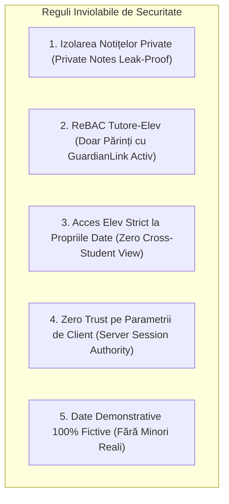

# SECURITY AND PRIVACY CHECKLIST — MEAI Edu

> **Versiune document:** 2.0.0 (Revizuit — Model Profesor Individual)  
> **Status:** Specificație Securitate & Protecția Datelor Minorilor  
> **Cadru Legal:** GDPR (Regulamentul UE 2016/679 Art. 6, 8), Principiul Minimizării Datelor

---

## 1. Pilonii de Securitate și Confidențialitate

---

## 2. Lista de Verificare de Securitate (Security & Privacy Checklist)

| Categorie | Cerință de Securitate | Mecanism de Implementare | Status | Protocol de Verificare |
| :--- | :--- | :--- | :---: | :--- |
| **Notițe Private Profesor** | `privateNotes` nu ajung NICIODATĂ la părinte sau elev | Excludere explicită din `select`-ul Prisma pentru rutele de părinte/elev; tipuri DTO separate | ✅ MANDATAT | Teste automate de scanare payload răspuns API pentru rolurile PARENT și STUDENT |
| **Autorizare Tutore (ReBAC)** | Părintele vede doar copiii asociați | Verificare server-side a `GuardianLink(status=ACTIVE)` înainte de orice interogare | ✅ MANDATAT | Test încercare interogare ID elev străin -> `404 Not Found` |
| **Izolare Elev** | Elevul vede doar orarul, temele și rezultatele proprii | Filtrare automată `WHERE studentId = session.studentId` pe server | ✅ MANDATAT | Test încercare acces date coleg -> `403 Forbidden` / `404 Not Found` |
| **Identitate Sesiune** | `role`, `userId`, `studentId` extrase doar din sesiune | Validare server în Server Actions; parametrii primiți prin URL/body sunt ignorați | ✅ MANDATAT | Test de manipulare a parametrilor de request (tampering) |
| **Distincție Feedback** | Feedback-ul publicat este separat de notițele interne | Tabele/coloane distincte: `publishedFeedback` (publicat) vs `privateTeacherNotes` (secret) | ✅ MANDATAT | Test de flux: publicare feedback și verificare vizibilitate selectivă |
| **Date Fictive Demo** | Zero date reale de minori sau profesori | Seed fictiv românesc complet: Prof. Radu Teodorescu, Fam. Popescu, Matei Popescu | ✅ MANDATAT | Verificare manuală a fișierului `prisma/seed.ts` |
| **Protecție Mesagerie** | Conversațiile sunt vizibile doar profesorului și părintelui implicat | Filtrare pe `conversation.guardianId == session.parentId` | ✅ MANDATAT | Test citire conversație străină -> `403 Forbidden` |

---

## 3. Politica pentru Modulul Demonstrativ

1. **Insignă Vizuală Permanentă:** Banner galben-cald în partea de sus: *„Mod Demonstrativ — Spațiul Didactic Prof. Radu Teodorescu (Date Fictive)”*.
2. **Fără Servicii Externe:** Zero apeluri către servicii terțe de tracking, SMS sau email gate în timpul rulării demo.
