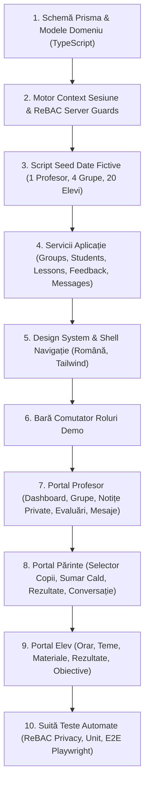

# SPRINT 0 PLAN — MEAI Edu (Gestiune Didactică & Conectare Familie)

> **Versiune document:** 2.0.0 (Revizuit — Model Profesor Individual)  
> **Status:** Planificare Arhitecturală Sprint 0  
> **Proiect:** MEAI Edu — Aplicație de Gestiune a Predării și Colaborare cu Familiile pentru un Profesor  
> **Limba principală:** Română (UI/UX și Documentație)

---

## 1. Obiectivul Sprintului (Sprint Objective)

Obiectivul principal al **Sprint 0** este construirea fundației arhitecturale (Next.js, TypeScript, PostgreSQL, Prisma), a modelului de autorizare server-side (ReBAC pentru relații tutore-elev) și livrarea **primei felii verticale demonstrabile** pentru **UN PROFESOR (Teacher Owner)** care își gestionează grupele, elevii, lecțiile, materialele, evaluările, notițele private și comunicarea caldă cu familiile.

La finalul Sprint 0, platforma va demonstra interacțiunea coerentă între cele **3 roluri principale**:
1. **PROFESOR / OWNER (Prof. Radu Teodorescu)**
2. **PĂRINTE / TUTORE (Fam. Popescu — cu acces exclusiv la copiii asociați)**
3. **ELEV (Matei Popescu — cu acces exclusiv la propriile date)**

Totul va fi susținut de un set de date demonstrative cu **4 tipuri de grupe** și aproximativ **20 de elevi**.

---

## 2. Funcționalități Incluse în Sprint 0 (In Scope)

| Modul | Funcționalitate Inclusă | Descriere & Comportament |
| :--- | :--- | :--- |
| **Demo Auth & Switcher** | Comutator rapid de roluri | Bară superioară securizată pentru comutarea instantanee între Profesor, Părinte și Elev. |
| **Gestiune Grupe** | 4 tipuri reprezentative de grupe | 1. Clasă școală, 2. Grupă meditații (Evaluare Națională), 3. Atelier robotică, 4. Meditație individuală 1-la-1. |
| **Elevi & Tutori** | Catalog elevi și asocieri tutori | Fişe elevi, date de contact, legături de tutelă verificate (`GuardianLink`), înscriere în una sau mai multe grupe. |
| **Orar & Prezență** | Ședințe recurente și prezență | Orar săptămânal pe grupe, consemnare rapidă prezență (Prezent, Absent, Întârziat, Învoit). |
| **Teme & Materiale** | Resurse educaționale și teme | Creare teme cu termene limită, atașare link-uri și fișiere suport pentru învățare. |
| **Rezultate & Evaluări** | Consemnare note/rezultate private | Notare evaluări, teste, proiecte, cu posibilitate de ciornă și publicare controlată. |
| **Notițe Private vs Feedback** | Separare strictă confidențialitate | Notițe private ale profesorului (strict secrete) vs Feedback pedagogic publicat către familie. |
| **Comunicare & Mesaje** | Anunțuri și conversații | Transmitere anunțuri pe grupă și schimb de mesaje directe profesor ↔ părinte. |
| **Obiective Personale (Goals)** | Ținte de învățare pentru elevi | Definire obiective individuale (ex. stăpânirea ecuațiilor de gradul II). |
| **Sumar Familie & Rapoarte** | Raport săptămânal cald | Dashboard dedicat părintelui cu sinteza progresului, aprecieri și calendarul săptămânii. |
| **Design System Cald** | UI Responsive & PWA-ready | Interfață în limba română, culori calme, fără alerte agresive sau clasamente comparative. |

---

## 3. Funcționalități Excluse din Sprint 0 (Out of Scope)

- ❌ Multi-school tenancy și administrare instituțională de liceu (directori, secretariat, inspectori).
- ❌ Integrări cu cataloagele naționale oficiale ale Ministerului Educației (SIIIR).
- ❌ Încheieri de medii oficiale de stat sau matricole școlare securizate guvernamental.
- ❌ Algoritmi AI de notare automată sau etichetare de risc a elevilor.
- ❌ Clasamente publice între elevi sau comparații competitive dăunătoare.
- ❌ Procesare reală de plăți online pentru ședințele de meditații (prevăzut pentru Faza 2).

---

## 4. Ordinea de Implementare (Implementation Order)



---

## 5. Structura Recomandată a Depozitului (Next.js Monolith)

```text
catalogCdC/
├── docs/
│   └── planning/                    # Documentația completă de arhitectură revizuită
├── prisma/
│   ├── schema.prisma                # Schema Prisma (PostgreSQL)
│   └── seed.ts                      # Script de populare cu 1 profesor, 4 grupe, 20 elevi
├── src/
│   ├── app/                         # Next.js App Router
│   │   ├── (auth)/                  # Autentificare & Demo Role Switcher
│   │   ├── teacher/                 # Portalul Profesorului
│   │   │   ├── dashboard/           # Prezentare generală activitate
│   │   │   ├── groups/              # Gestiune grupe & detalii
│   │   │   ├── students/            # Dosare elevi & notițe private
│   │   │   ├── attendance/          # Consemnare prezență
│   │   │   ├── lessons/             # Ședințe & orar
│   │   │   ├── assignments/         # Teme & materiale
│   │   │   ├── assessments/         # Evaluări & rezultate
│   │   │   ├── feedback/            # Feedback publicat către familii
│   │   │   ├── announcements/       # Anunțuri pe grupă
│   │   │   ├── conversations/       # Mesagerie directă cu părinții
│   │   │   ├── calendar/            # Calendar săptămânal
│   │   │   ├── reports/             # Rapoarte de progres
│   │   │   └── settings/            # Setări profesor
│   │   ├── parent/                  # Portalul Părintelui
│   │   │   ├── dashboard/           # Sumar săptămânal & selector copii
│   │   │   ├── timetable/           # Orar copil
│   │   │   ├── attendance/          # Prezență copil
│   │   │   ├── assignments/         # Teme copil
│   │   │   ├── results/             # Rezultate & aprecieri
│   │   │   ├── feedback/            # Feedback primit
│   │   │   ├── goals/               # Obiective copil
│   │   │   ├── announcements/       # Anunțuri
│   │   │   └── conversations/       # Dialog cu profesorul
│   │   ├── student/                 # Portalul Elevului
│   │   │   ├── dashboard/           # Panou personal învățare
│   │   │   ├── timetable/           # Orar personal
│   │   │   ├── assignments/         # Teme de rezolvat
│   │   │   ├── materials/           # Materiale de studiu
│   │   │   ├── results/             # Rezultate proprii
│   │   │   ├── feedback/            # Aprecieri primite
│   │   │   ├── goals/               # Obiective personale
│   │   │   └── announcements/       # Anunțuri grupă
│   │   ├── layout.tsx               # Root Layout cu Demo Switcher Bar
│   │   └── page.tsx                 # Prezentare & login
│   ├── components/
│   │   ├── ui/                      # Primitive UI (Button, Card, Modal, Badge, Drawer)
│   │   ├── layout/                  # Navigație specifică rolurilor, Header, DemoBar
│   │   └── shared/                  # Componente comune (FeedbackCard, TimetableCalendar)
│   ├── lib/                         # Prisma Client, utilitare date RO, autorizare
│   └── services/                    # Logică de aplicație și interogări optimizate
├── tests/
│   ├── unit/                        # Teste reguli de domeniu și formate
│   ├── security/                    # Teste izolare notițe private și ReBAC părinte-copil
│   └── e2e/                         # Teste Playwright pentru fluxurile celor 3 roluri
├── package.json
├── tsconfig.json
└── tailwind.config.ts
```
