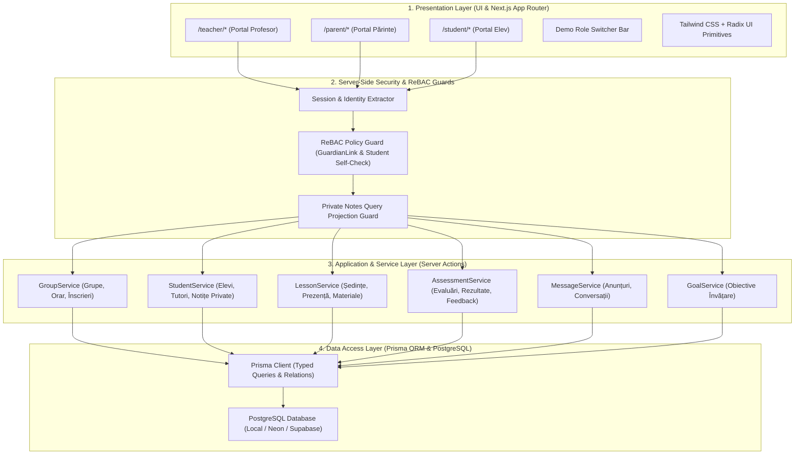

# TECHNICAL ARCHITECTURE & SYSTEM DESIGN — MEAI Edu

> **Versiune document:** 2.0.0 (Revizuit — Model Profesor Individual)  
> **Status:** Specificație Tehnică de Arhitectură  
> **Paradigmă:** Next.js Monolith (TypeScript + Prisma + PostgreSQL)

---

## 1. Topologia Arhitecturală (Next.js Monolith)

Pentru a asigura o viteză maximă de execuție, mentenanță impecabilă și eliminarea oricărei complexități artificiale, **MEAI Edu** este construit ca o aplicație unică **Next.js Monolith** cu Server Actions, Route Handlers și Prisma ORM:



---

## 2. Decizii de Simplificare Arhitecturală

1. **Un Singur Repository și o Singură Aplicație:** Fără backend separat în NestJS, Express sau microservicii. Next.js gestionează atât randarea interfeței (Server Components + Client Components), cât și logica de server (Server Actions & Route Handlers).
2. **PostgreSQL + Prisma ORM:** Modelare relațională clară, migrații declarate în fișierul `schema.prisma` și generare automată de tipuri TypeScript sigure.
3. **Workspace Intern (`workspaceId`):** În baza de date se păstrează un câmp `workspaceId` asociat profesorului pentru a asigura scalabilitate viitoare dacă platforma va fi extinsă pentru mai mulți profesori, însă întreaga experiență vizuală și logică curentă tratează profesorul ca proprietar unic.
4. **Fără dependințe greoaie de cloud în Sprint 0:** Pentru demonstrare și testare rapidă, baza de date poate rula pe un PostgreSQL local (sau containerizat via Docker) populat complet prin scriptul de seed `prisma/seed.ts`.

---

## 3. Politica de Autorizare pe Server (Server-Side ReBAC)

Toate operațiunile critice sunt protejate direct pe server:

```typescript
// Structura contextului de sesiune autentificat
export interface UserSessionContext {
  readonly userId: string;
  readonly role: "TEACHER" | "PARENT" | "STUDENT";
  readonly teacherId?: string;
  readonly parentId?: string;
  readonly studentId?: string;
  readonly workspaceId: string;
}

// Exemplu guard server-side pentru acces la datele unui elev
export async function assertCanAccessStudent(
  session: UserSessionContext, 
  targetStudentId: string
): Promise<void> {
  if (session.role === "TEACHER") {
    // Profesorul are acces la toți elevii din workspace
    return;
  }
  
  if (session.role === "STUDENT") {
    if (session.studentId !== targetStudentId) {
      throw new Error("UNAUTHORIZED_STUDENT_ACCESS");
    }
    return;
  }
  
  if (session.role === "PARENT") {
    // Verificăm existența unei legături active de tutelă
    const link = await prisma.guardianLink.findFirst({
      where: {
        parentId: session.parentId,
        studentId: targetStudentId,
        status: "ACTIVE"
      }
    });
    if (!link) {
      throw new Error("UNAUTHORIZED_GUARDIAN_ACCESS");
    }
    return;
  }
  
  throw new Error("INVALID_ROLE");
}
```

---

## 4. Confidențialitatea Notițelor Private (Private Notes Guard)

Notițele profesorului despre dificultățile, observațiile de comportament sau strategiile pedagogice interne sunt **strict confidențiale**.

Pentru a garanta că nicio notiță privată nu ajunge accidental la părinte sau elev:
1. **La nivel de interogare Prisma:** Se exclude explicit coloana `privateNotes` când cererea provine de la un `PARENT` sau `STUDENT`:
```typescript
const studentData = await prisma.student.findUnique({
  where: { id: studentId },
  select: {
    id: true,
    firstName: true,
    lastName: true,
    // privateNotes este inclus DOAR dacă session.role === "TEACHER"
    privateNotes: session.role === "TEACHER",
    publishedFeedback: true,
    results: true,
    attendance: true
  }
});
```
2. **La nivel de tipuri DTO:** Tipurile de date trimise către clientul de părinte/elev nu conțin proprietatea `privateNotes`.

---

## 5. Pregătire pentru PWA & Rulare Mobilă

- **PWA Ready:** Manifest PWA configurat (`manifest.json`), service worker pentru caching assets și iconițe adaptate pentru ecranul de start iOS/Android.
- **Optimizare Touch:** Butoane cu suprafață minimă de atingere de 44x44px, bottom sheet-uri ergonomice pentru selecții rapide pe telefon.
- **Răspuns Rapid:** Toate tranzițiile UI sub 100ms.
