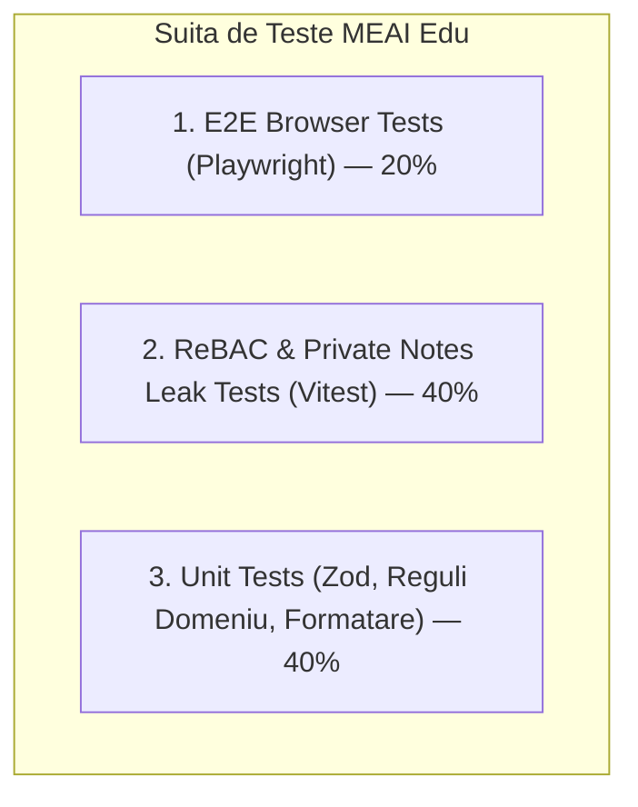

# TEST STRATEGY & QUALITY ASSURANCE — MEAI Edu

> **Versiune document:** 2.0.0 (Revizuit — Model Profesor Individual)  
> **Status:** Strategie de Testare & Asigurare a Calității  
> **Instrumente:** Vitest, Playwright, Axe-core, Prisma Test Environment

---

## 1. Piramida de Testare

---

## 2. Categorii de Teste și Obiective

### 2.1. Teste de Securitate și Izolare Notițe Private (ReBAC Security Suite)
- **Leak Test Notițe Private:** Interogare executată cu rol `PARENT` sau `STUDENT` pe dosarul elevului -> Se verifică că răspunsul JSON **nu conține** cheia `privateNotes` sau `privateTeacherNotes`.
- **Negative ReBAC Tutore:** Părintele A încearcă să obțină situația elevului B (neasociat) -> Așteptat: `404 Not Found`.
- **Negative ReBAC Elev:** Elevul A încearcă să acceseze rezultatele elevului B -> Așteptat: `403 Forbidden` / `404 Not Found`.
- **Tampering Test:** Trimitere request cu `studentId` modificat în payload -> Serverul validează împotriva sesiunii și respinge request-ul.

### 2.2. Teste Unitare (Unit Tests)
- **Validare Zod:** Validare formulare pentru creare grupe, introducere rezultate evaluare, compunere mesaje și definire obiective.
- **Formatare Date & Orar RO:** Verificare afișare corectă a zilelor săptămânii în limba română (Luni, Marți...) și a intervalelor orare (ex. 16:00 - 18:00).
- **Logică Obiective:** Schimbarea stării obiectivelor (`isCompleted: true`, setare `completedAt`).

### 2.3. Teste de Integrare (Database & Seed Suite)
- Verificarea că scriptul `prisma/seed.ts` populează corect 1 profesor, 4 grupe, 20 elevi și legăturile de tutelă fără violări de chei unice.

### 2.4. Teste End-to-End în Browser (Playwright)
1. **Teacher Flow:** Conectare ca Profesor Teodorescu -> Deschidere grupă Meditații -> Marcare prezență -> Adăugare notiță privată -> Publicare feedback cald pentru elevul Matei Popescu.
2. **Parent Flow:** Conectare ca Fam. Popescu -> Vizualizare sumar Matei -> Comutare pe Sofia Popescu -> Verificare orar -> Trimitere mesaj către profesor în modulul de conversație.
3. **Student Flow:** Conectare ca Elev Matei -> Vizualizare orar ședință -> Descărcare material didactic -> Marcare temă rezolvată -> Adăugare obiectiv personal.
4. **Demo Switcher Flow:** Comutare succesivă între Teacher, Parent și Student din bara superioară, verificând adaptarea instantanee a interfeței.

### 2.5. Teste de Accesibilitate & Responsive (A11y)
- Scanare cu `axe-core` pe toate paginile (contrast culori, etichete câmpuri, atribute ARIA).
- Verificare randare pe viewport mobil (375x812), tabletă (768x1024) și desktop (1440x900).
