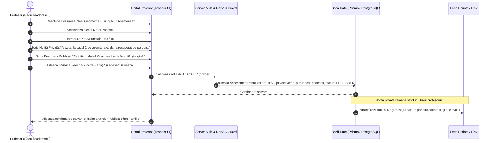
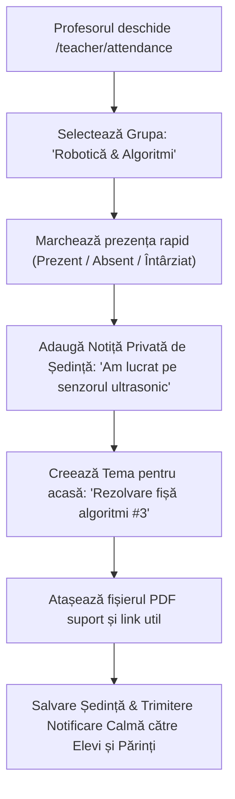
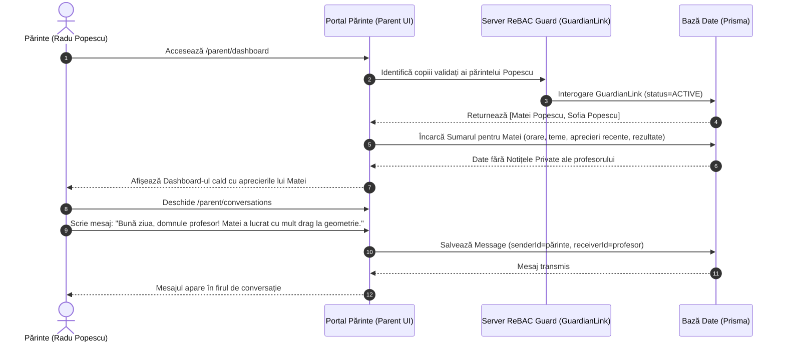
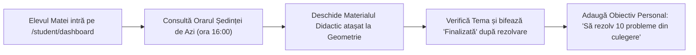
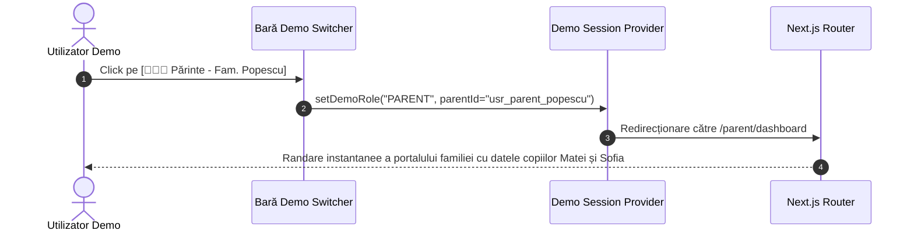

# USER FLOWS & INTERACTION JOURNEYS — MEAI Edu

> **Versiune document:** 2.0.0 (Revizuit — Model Profesor Individual)  
> **Status:** Specificație Fluxuri Utilizator & Diagrame de Interacțiune  
> **Platformă:** MEAI Edu (Gestiune Didactică & Conectare Familie)

---

## 1. Fluxul Profesorului: Consemnare Rezultat Evaluare & Publicare Feedback

Acest flux descrie cum profesorul (Prof. Radu Teodorescu) introduce rezultatul unei evaluări (ex. Testul la Geometrie la Grupa de Pregătire Evaluare Națională), adaugă o notiță privată confidențială și publică o apreciere caldă către părinți.

---

## 2. Fluxul Profesorului: Desfășurare Ședință, Prezență & Notițe de Curs

---

## 3. Fluxul Părintelui: Sumar Săptămânal, Comutare Copii & Conversație Directă

---

## 4. Fluxul Elevului: Orar, Teme, Materiale & Obiective de Învățare

---

## 5. Fluxul Comutatorului de Roluri Demo (Demo Switcher)

