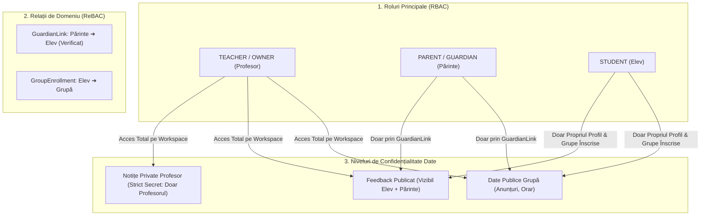

# USER ROLES AND PERMISSIONS (RBAC & ReBAC MATRIX)

> **Versiune document:** 2.0.0 (Revizuit — Model Profesor Individual)  
> **Status:** Specificație Securitate & Matrice de Autorizare  
> **Sistem:** MEAI Edu Authorization Engine

---

## 1. Arhitectura de Securitate și Relații (ReBAC Model)

Modelul de autorizare se bazează pe trei roluri clare și pe verificarea strictă a relațiilor de domeniu pe server:

---

## 2. Definirea Rolurilor

| Rol | Denumire RO | Descriere & Responsabilități |
| :--- | :--- | :--- |
| `TEACHER` | Profesor / Titular Spațiu Didactic | Proprietarul workspace-ului. Creează și editează grupe, adaugă elevi și tutori, definește orare, consemnează prezența, creează teme, adaugă materiale, introduce rezultate, scrie notițe private confidențiale, publică feedback pedagogic și comunică cu părinții. |
| `PARENT` | Părinte / Tutore Legal | Are acces strict la informațiile copiilor asociați prin `GuardianLink` valid: orar, prezență, teme, rezultate, feedback publicat, obiective, anunțuri și conversația directă cu profesorul. |
| `STUDENT` | Elev | Are acces strict la propriile informații: orarul grupelor în care este înscris, temele de rezolvat, materialele didactice de studiu, rezultatele și aprecierile primite, obiectivele personale și anunțurile grupelor sale. |

---

## 3. Matricea Generală de Permisiuni

| Acțiune / Resursă | TEACHER (Owner) | PARENT (Tutore) | STUDENT (Elev) |
| :--- | :---: | :---: | :---: |
| **Gestiune Grupe (Creare, Editare, Ștergere)** | ✅ | ❌ | ❌ |
| **Gestiune Elevi & Asocieri Tutori** | ✅ | ❌ | ❌ |
| **Definire Orar & Ședințe Recurente** | ✅ | ❌ | ❌ |
| **Marcare Prezență la Ședințe** | ✅ | ❌ | ❌ |
| **Citire Prezență** | ✅ *(Toți Elevii)* | ✅ *(Doar Copil Propriu)* | ✅ *(Doar Sine)* |
| **Creare / Editare Teme & Materiale** | ✅ | ❌ | ❌ |
| **Citire Teme & Descărcare Materiale** | ✅ *(Toate Grupele)* | ✅ *(Doar Grupele Copilului)* | ✅ *(Doar Grupele Sale)* |
| **Înregistrare Rezultate & Evaluări** | ✅ | ❌ | ❌ |
| **Citire Rezultate Evaluare** | ✅ *(Toți Elevii)* | ✅ *(Doar Copil Propriu)* | ✅ *(Doar Sine)* |
| **Scriere Notițe Private (Private Notes)** | ✅ | ❌ *(Interzis)* | ❌ *(Interzis)* |
| **Citire Notițe Private (Private Notes)** | ✅ *(Strict Secret)* | ❌ *(Niciodată)* | ❌ *(Niciodată)* |
| **Publicare Feedback Pedagogic** | ✅ | ❌ | ❌ |
| **Citire Feedback Publicat** | ✅ | ✅ *(Doar Copil Propriu)* | ✅ *(Doar Sine)* |
| **Creare / Transmitere Anunțuri** | ✅ | ❌ | ❌ |
| **Citire Anunțuri pe Grupă** | ✅ | ✅ *(Grupele Copiilor)* | ✅ *(Grupele Sale)* |
| **Trimitere Mesaj în Conversație Directă** | ✅ | ✅ *(Cu Profesorul)* | ❌ *(Opțional viitor)* |
| **Definire Obiective de Învățare (Goals)** | ✅ | ❌ *(Vizualizare)* | ✅ *(Adăugare obiective proprii)* |

---

## 4. Regula Fundamentală de Confidențialitate: Notițe Private vs Feedback Publicat

> [!IMPORTANT]
> **Izolarea Notițelor Private:** Câmpul `privateNotes` de pe dosarul elevului sau de la ședințele de curs aparține exclusiv profesorului.
> - Interogările realizate de părinți sau elevi **exclud explicit** aceste câmpuri la nivel de proiecție Prisma (`select: { privateNotes: false }`).
> - Nicio eroare de serializare nu poate expune notițele private în API response-urile pentru rolurile `PARENT` sau `STUDENT`.

---

## 5. Matricea de Testare a Accesului Neautorizat (Negative Security Matrix)

| Scenariu de Test Negativ | Actor | Resursă Țintă | Răspuns Așteptat | Motivare Securitate |
| :--- | :--- | :--- | :---: | :--- |
| **1. Părinte încearcă acces la datele altui elev** | Părinte (Copil: Matei) | Rezultate / Prezență Elev Sofia (neasociată) | `404 Not Found` | Lipsă `GuardianLink` activ. Se returnează `404` pentru a nu divulga existența ID-ului de elev. |
| **2. Părinte încearcă să citească Notițele Private** | Părinte | `GET /api/students/:id/notes` | `403 Forbidden` | Notițele private sunt accesibile exclusiv rolului `TEACHER`. |
| **3. Elev încearcă să vadă rezultatele unui coleg** | Elev A | Rezultate Elev B | `403 Forbidden` / `404 Not Found` | Elevul are acces strict la `studentId == session.studentId`. |
| **4. Elev încearcă să creeze sau editeze o temă** | Elev | `POST /api/assignments` | `403 Forbidden` | Doar `TEACHER` poate crea teme. |
| **5. Elev încearcă să modifice prezența** | Elev | `POST /api/attendance` | `403 Forbidden` | Consemnarea prezenței este drept exclusiv `TEACHER`. |
| **6. Părinte încearcă să trimită anunț pe grupă** | Părinte | `POST /api/announcements` | `403 Forbidden` | Anunțurile pe grupă sunt emise doar de profesor. |
| **7. Utilizator neautentificat** | Vizitator Anonim | Orice rută protejată | `401 Unauthorized` | Redirecționare imediată către ecranul de login / demo switcher. |
| **8. Manipulare ID din Browser (Client Tampering)** | Client modifică `studentId` în payload | Datele altui elev | `403 Forbidden` | ID-urile din sesiune sunt validate pe server la fiecare Server Action / Route Handler. |
